# iron-hack-lab-1

## 1. Simulación de estrategia de sucursal

* Clonar repositorio
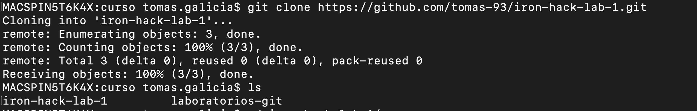

* Crear branch
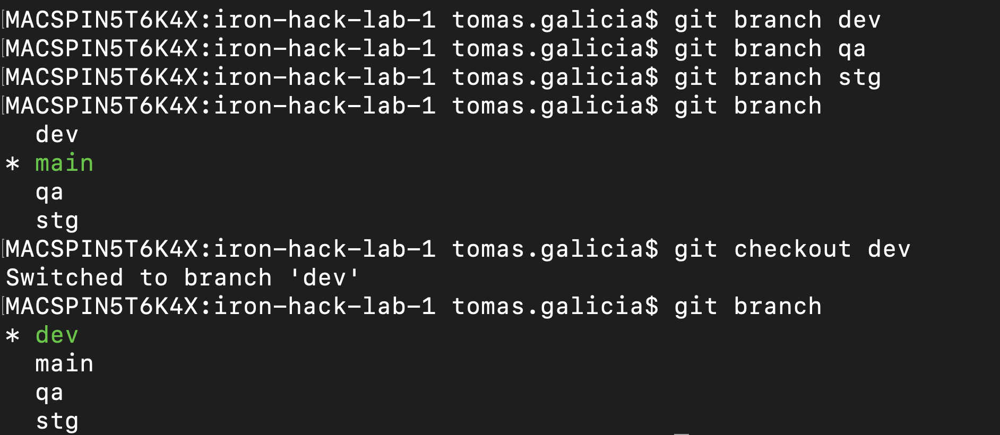

* Crear archivo y generar commit en DEV
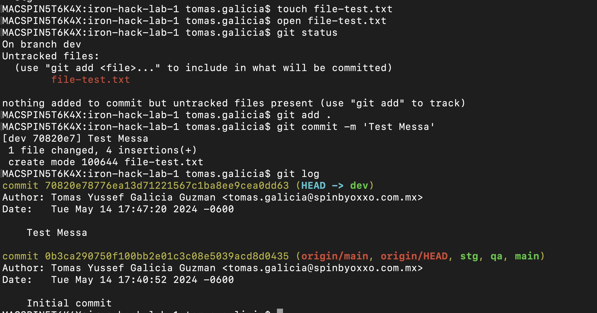

* Merge a QA
  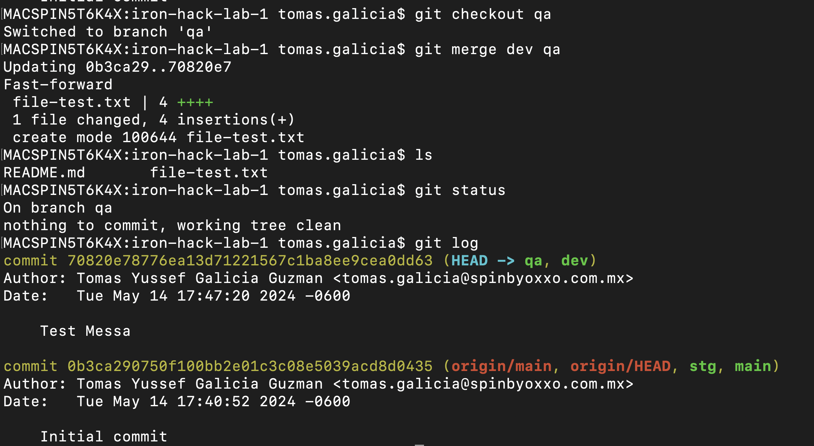

* Merge a STG
  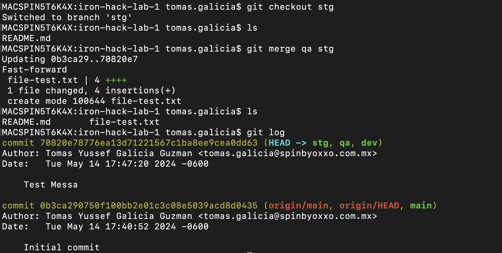

* Merge a MAIN
  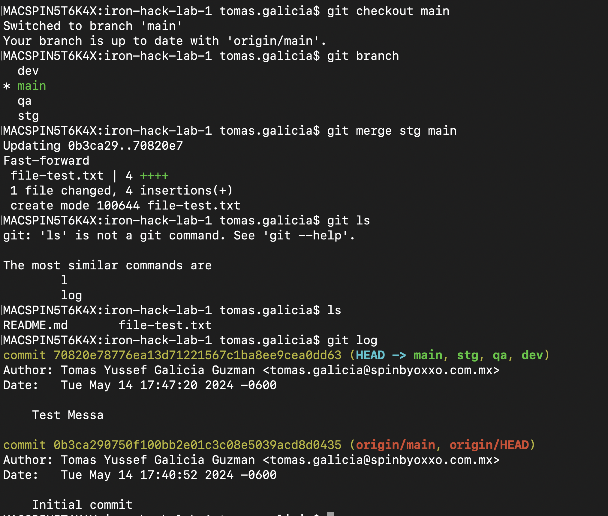

## 2. Resolución de conflictos y fusión
* Se modifica el archivo
  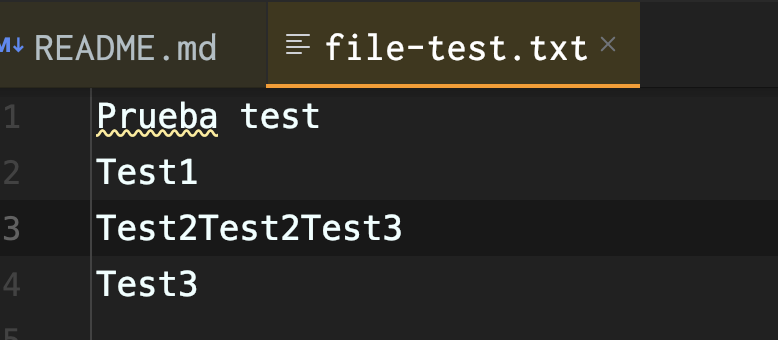
* Se genera commit
  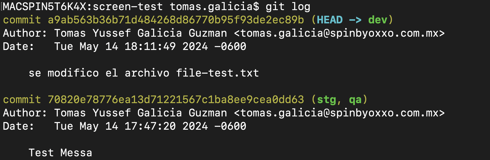

  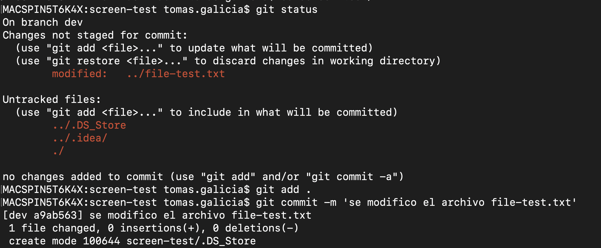

*  Crear PR
  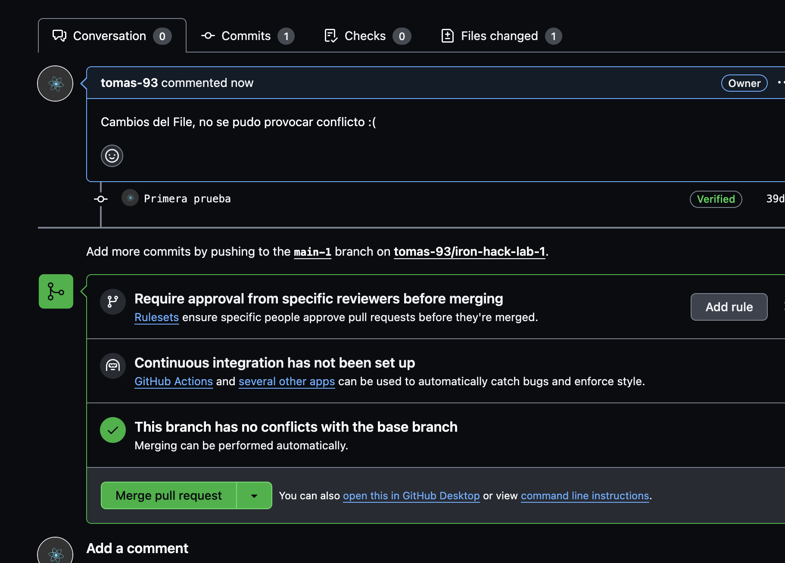

  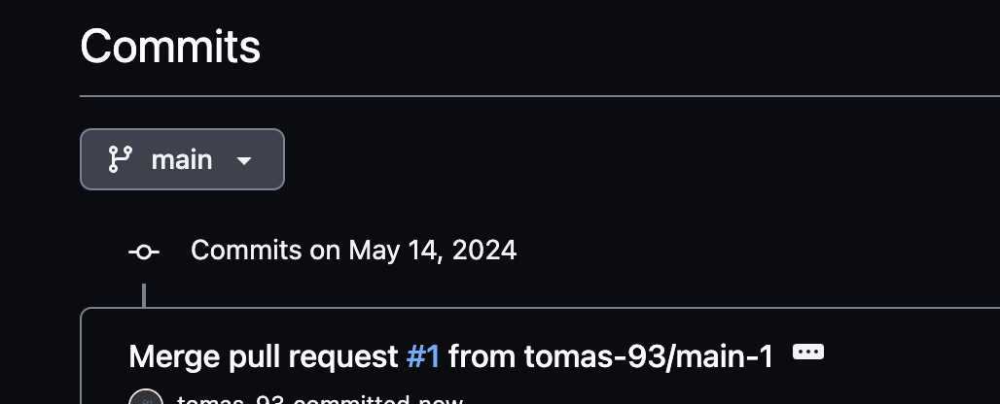

  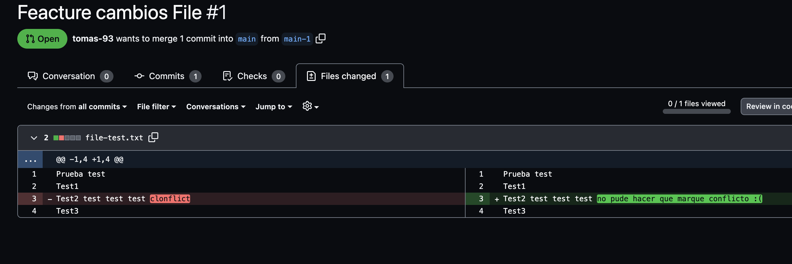

## 3. Solicitud de extracción y simulación de revisión de código
